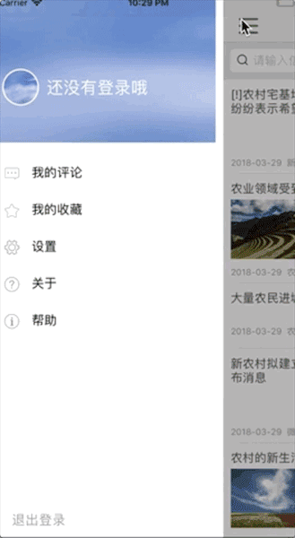
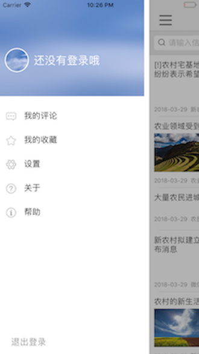

# SwiftEFarm
我的第一个swift项目

效果图:





### 阅读这个项目你可以学到的东西:


- 如何创建一个文件目录清晰的项目
- swift基本语法,例如普通属性和计算属性,类别,外部方法内部方法等...
- swift侧滑轮子的封装
- 完整的MVVM编程思路
- swift下Model处理
- swift使用CocoaPod导入第三方, 使用混编使用OC第三方
- 3DTouch快速启动和Peek/Pop
- TablveView的性能优化
- iOS11的适配和iPhone X的适配


>
> 以上的知识点基本按照写这个项目的时间顺序来总结的, 其实到3DTouch本来就打算结束项目的, 结果发现升级iOS 11之后系统的TableView变得更加卡顿, 不优化的情况下用户体检很不好(怀疑的可以看看iOS11.0的iPhone 设置->移动蜂窝网络 滑动测试一下), 所以彻底进行了优化, 同时顺便适配iPhone X, 至此项目完结

---
## 项目目录阅读指导

这个项目从Xcode的singleView模板创建而来, 经过文件整理归类和修改创建了一个标准易于维护的模板, 最终的你可以通过以下链接学习

#### [一步一步创建一个标准的iOS项目模板](https://my.oschina.net/bieshixuan/blog/775507)

最终结果如下:


#### 作为项目阅读指导模块,介绍一下项目目录框架

```
项目使用swift4编写, 适配最新iPhoneX


    Constant 模块
        AppUrl : 定义url静态变量
        PublicConstant : 定义cellidentifier, ScreenWidth等变量, BaseColor等变量, 封装view的一些属性(.width等), UIDevice分类判断iPhone X

    MianCode 模块
        各个模块 每个模块分位四块:controller(界面跳转,view切换), control(数据下载, 解析model), model(model申明), cell(view)    
 
    General 模块
        UserInfo : 示例封装set/get UserDefaults   
        RootController : 封装侧滑界面 (这是本项目的第一个类, 也是我开始学习swift的第一个类, 包含基本语法的注释)

    Library 模块
        示例使用OC混编, 没有使用CocoaPod的第三方库
        包括 : MJRefresh, DZNEmptyDataSet 等

    Resouce 模块
        图片文件
        
    Config模块
        项目初始文件


    Pod
        'Alamofire'      网络请求
        'SwiftyJSON'     Json解析
        'Kingfisher'     image缓存
        'PKHUD'          加载动画

```


---
因为这个项目是第一次使用swift语言, 所有淌了很多水, 也是查阅了很多资料, 会在以下博客中体现.
项目对于使用哪个轮子也是做了很多考察, 使用pod还是本地等.
对与项目的整体设计和UI体验做的一些优化.

至此项目也是比较完美了. 欢迎提意见

## [关于此项目的博客, 重磅上线😄](https://my.oschina.net/bieshixuan/blog/1541883)


)


